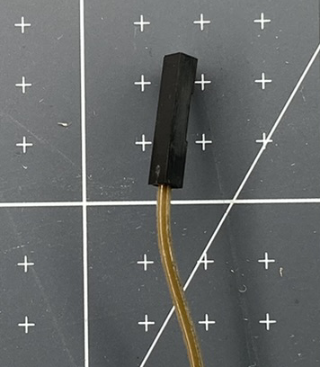

تستخدم أسلاك التوصيل لنقل التيار الكهربائي بين المكونات الإلكترونية. يتم استخدامها في مشاريع النماذج الأولية لأنها تسمح لك بإرفاق وفصل المكونات دون الحاجة إلى لحام (إنشاء المزيد من التوصيلات الدائمة عن طريق صهر المعدن).

هناك ثلاثة أنواع مختلفة من أسلاك التوصيل:

+ قابس
+ دبوس المقبس
+ دبوس-دبوس

يتم التعرف على كل منها من خلال ما يوضع عند كل طرف من السلك.

### الدبوس

يمتلك طرف الدبوس قطعة معدنية قصيرة تخرج من نهاية الطرف البلاستيكي الأسود. يمكن وضعها داخل طرف المقبس أو في لوحة التجارب.

### المقبس

يبدو طرف المقبس كقطعة صغيرة من البلاستيك الأسود. يحتوي على فتحة بالداخل يمكنها استقبال طرف دبوس سلك التوصيل أو أرجل متصلة بمكونات كهربائية أخرى.

### شراء أسلاك توصيل

عند شراء أسلاك توصيل ، قد تلاحظ أنها تسمى ذكر - ذكر (m-m) ، أنثى - أنثى (f-f) -ذكر - أنثى (m-f). هذه لغة قديمة (سابقة) تستخدم لوصف نهايات الأسلاك. **الدبوس** و**المقبس** هي مصطلحات أكثر شمولاً يجب استخدامها الآن لوصف أسلاك التوصيل. 