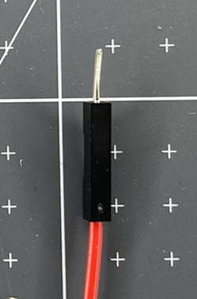

تستخدم أسلاك التوصيل لنقل التيار الكهربائي بين المكونات الإلكترونية. يتم استخدامها في مشاريع النماذج الأولية لأنها تسمح لك بإرفاق وفصل المكونات دون الحاجة إلى لحام (إنشاء المزيد من التوصيلات الدائمة عن طريق صهر المعدن).

هناك ثلاثة أنواع مختلفة من أسلاك التوصيل:

+ قابس
+ دبوس المقبس
+ pin-pin

يتم التعرف على كل منها من خلال ما يوضع عند كل طرف من السلك.

### الدبوس

A pin end has a short piece of metal sticking out of the black plastic end. This can be placed inside a socket end or into a breadboard.

### The socket

The socket end looks like a small piece of black plastic. It has a hole inside that can receive a pin end of a jumper wire or the legs attached to other electrical components.

### Purchasing jumper wires

When purchasing jumper wires you may notice that they are called male-male (m-m), female-female (f-f) and male-female (m-f). This is legacy (prior) language used to describe the ends of the wires. **Pin** and **socket** are more inclusive terms that should now be used to describe jumper wires. 