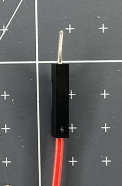

Jumper wires are used to carry the electrical current between electronics components. They are used for prototyping projects because they allow you to attach and detach components without the need for soldering (creating more permanent connections by melting metal).

There are three different types of jumper wire:

+ socket-socket
+ pin-socket
+ pin-pin

Each is recognised by what is placed at each end of the wire. 

### The pin

A pin end has a short piece of metal sticking out of the black plastic end. This can be placed inside a socket end or into a breadboard. 

## The socket

The socket end looks like a small piece of black plastic. It has a hole inside that can receive a pin end of a jumper wire or the legs attached to other electrical components. 

## Purchasing jumper wires

When purchasing jumper wires you may notice that they are called male-male (m-m), female-female (f-f) and male-female (m-f). This is legacy (prior) language used to describe the ends of the wires. **Pin** and **socket** are more inclusive terms that should now be used to describe jumper wires. 