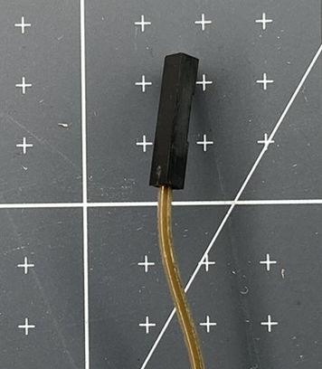

Les fils de liaison sont utilisés pour transporter le courant électrique entre les composants électroniques. Ils sont utilisés pour les projets de prototypage car ils te permettent de fixer et de détacher des composants sans avoir besoin de soudure (création de connexions plus permanentes en faisant fondre le métal).

Il existe trois types de fil de liaison différents :

+ prise - prise
+ broche - prise
+ broche - broche

Chacun est reconnu par ce qui est placé à chaque extrémité du fil.

### La broche

Une extrémité broche a un petit morceau de métal qui sort de l'extrémité en plastique noir. Cela peut être placé à l'intérieur d'une extrémité prise ou dans une platine d'expérimentation.

### La prise

L'extrémité prise ressemble à un petit morceau de plastique noir. Il a un trou à l'intérieur qui peut recevoir une extrémité broche d'un fil de liaison ou les pattes attachées à d'autres composants électriques.

### Achat de fils de liaison

Lors de l'achat de fils de liaison, tu remarqueras peut-être qu'ils sont appelés mâle-mâle (mm), femelle-femelle (ff) et mâle-femelle (mf). Il s'agit d'un langage hérité (antérieur) utilisé pour décrire les extrémités des fils. **Broche** et **prise** sont des termes plus inclusifs qui doivent maintenant être utilisés pour décrire les fils de connexion. 